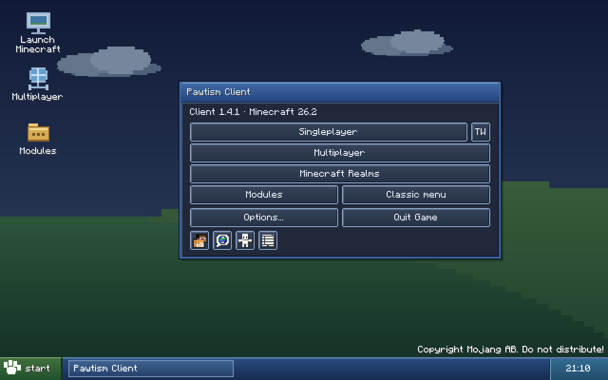
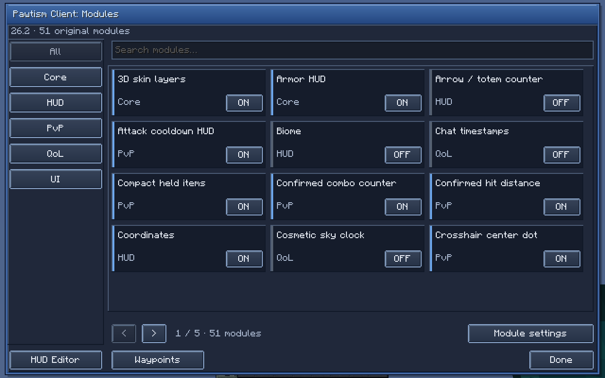
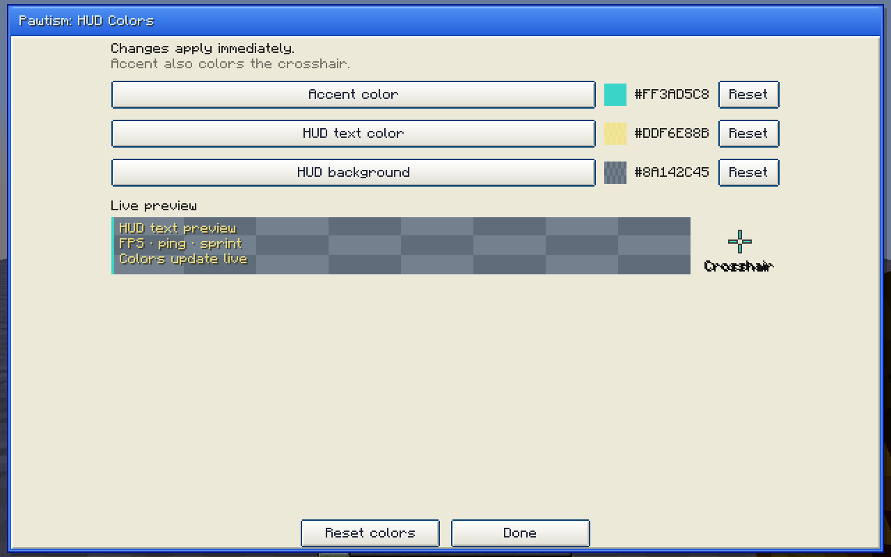

# Pawtism Client

A simple Fabric client for Minecraft **26.2**, with zoom, configurable HUDs, waypoints and visual quality-of-life features.

**Version 1.4.1** includes Pawtism's official Discord application, so Rich Presence works without entering an application ID. It stays off until you enable it. HUD colors, the XP interface and Dark mode remain available, with **52 feature toggles** and **22 movable HUD panels**.

## Screenshots

## Downloads

This repository includes Java source and precompiled downloads. Use the compiled release to install.

- [Pawtism Client 1.4.1 JAR](downloads/pawtism-client-1.4.1+26.2.jar)
- [Install bundle with all four libraries](downloads/PawtismClient-1.4.1-26.2.zip)
- [Source archive](downloads/PawtismClient-1.4.1-26.2-source.zip)
- [GitHub releases](https://github.com/AidenRTRRgfdm/Pawtism-Client/releases)

The install bundle contains Pawtism and its four required libraries. Checksums are included with the downloads.

## Requirements

- Minecraft **26.2**
- Fabric Loader **0.19.5 or later**
- Java **25**
- The four libraries listed below

## Installation

1. Create a Fabric instance for Minecraft 26.2 in your launcher.
2. Download the Pawtism Client JAR and all four required libraries.
3. Put the five JARs in that instance's `mods` folder.
4. Launch Minecraft and press **Right Shift** to open Pawtism.

The install bundle already contains all five JARs. Extract it and copy the contents of its `mods` folder into your instance.

Pawtism runs on your client. Servers do not need to install it.

### Required libraries

These versions match Pawtism 1.4.1 for Minecraft 26.2.

| Library | Version |
| --- | --- |
| [Fabric API](https://modrinth.com/mod/fabric-api/version/ewUK83HI) | 0.161.0+26.2 |
| [MaLiLib](https://modrinth.com/mod/malilib/version/KvjmGjAV) | 0.29.6 |
| [Mod Menu](https://modrinth.com/mod/modmenu/version/iRo7AZXf) | 20.0.3 |
| [Text Placeholder API](https://modrinth.com/mod/placeholder-api/version/NDqH16LT) | 3.1.0-beta.1+26.2 |

Text Placeholder API is required by this version of Mod Menu.

## Controls

| Control | Action |
| --- | --- |
| **Right Shift** | Open the module browser |
| Hold **Z** | Zoom; 4× by default |
| **N** | Open the waypoint editor |
| **B** | Show or hide waypoint markers |
| Normal sprint key | Toggle sprint when the module is enabled |
| Normal drop key | Confirm a protected item drop with a second press |

You can change Pawtism's keybinds in Minecraft Controls. The settings button in **Mods → Pawtism Client** opens the same module browser.

## XP interface and Dark mode

The XP interface is enabled by default. The title screen becomes a desktop with an original sky-and-hills background, a blue Pawtism window and a taskbar. The background and window chrome use colored shapes and require no extra resource pack.

Menus also use classic button, checkbox, slider, text-field, list, scrollbar, tooltip and inventory-panel styling. Minecraft keeps its normal menu actions, keyboard input, item slots and progress indicators.

- Choose **Modules** on the desktop to open Pawtism.
- Choose **Classic menu** to turn the theme off and return to Minecraft's title screen.
- While playing, press **Right Shift**, choose **UI**, and switch **XP interface** on or off.
- From the classic title screen, use **Mods → Pawtism Client → settings**, then **UI**, to enable it again.

**Dark mode** is off by default, so the light XP palette remains the default. With **XP interface** enabled, use **Right Shift → UI → Dark mode** for charcoal window bodies, darker desktop scenery and lighter labels. The palette changes immediately without a restart. It applies to the desktop, native menus, module browser, waypoint editor, detailed settings, Mod Menu, tooltips and inventory panels.

The XP and dark preferences are saved with your other Pawtism settings. Turning **XP interface** off restores the vanilla appearance and keeps your dark preference for the next time you enable XP.

## Features

### Everyday essentials

- Zoom and native toggle sprint
- FPS, ping, server address and sprint status
- Armor durability, saturation and held-food values
- Custom crosshair, shulker previews and saved waypoints
- 3D skin layers and flat dropped items

### More HUD options

- Coordinates, compass, biome and movement speed
- Potion timers, held-item durability and inventory preview
- Arrow and totem counts
- Clock, session timer, memory usage and online players
- Light level, world day, resource packs and a frame-time graph

### PvP information and comfort

- Left/right CPS, keystrokes and attack charge
- Confirmed combo counter and approximate hit distance
- Lower fire overlay, stable hurt camera and compact held items
- Crosshair center dot and target color

### Quality of life

- Death coordinates and automatic death waypoints
- Held-item drop guard and a manual reconnect countdown
- Chat timestamps and native toggle sneak
- Cosmetic sky time and local clear weather
- Optional hiding of scoreboards, boss bars, titles and toast cards

The **UI** category contains XP interface, Dark mode and Discord Rich Presence toggles. See the [full feature reference](docs/FEATURES.md) for every toggle and its behavior.

## Arrange your HUD

1. Enable the panels you want in the module browser.
2. Open **HUD Editor**.
3. Drag a panel, or select it and use the arrow keys for small adjustments.
4. Choose **Save & Done**.

Panel positions adapt to the window size. **Reset layout** restores the default arrangement. **Module settings** opens the detailed settings for the selected category, including colors, sizes and limits.

## HUD colors

Open **HUD Colors** from the module browser or **HUD Editor**. There are three controls:

- **Accent color:** the existing control for panel accents and the crosshair.
- **HUD text color:** labels throughout Pawtism's HUD panels.
- **HUD background color:** panel backgrounds, including transparency.

Use the native color picker to edit HSV, RGB, hex and alpha values. The preview updates immediately. Each value has a reset button; **Reset colors** restores all three defaults. Colors save with your other settings.

## Discord Rich Presence

Pawtism can show **Main menu**, **Singleplayer** or **Multiplayer** in the Discord desktop app, with a session timer. The feature is off by default.

1. Start the Discord desktop app.
2. Press **Right Shift** and choose **UI**.
3. Turn on **Discord Rich Presence**.

Leave **Discord application ID** blank to use Pawtism's official application. You can enter a different public application ID under **UI → Module settings**. Clear that field to return to Pawtism's application; existing custom IDs are preserved when you upgrade.

No account token, bot token or client secret is needed. Presence excludes server addresses, world names, coordinates and chat. Disabling the module or closing Minecraft clears its activity. See the [Discord setup guide](docs/DISCORD_RPC.md).

## Upgrading and saved settings

- Replace the older Pawtism JAR; keep only one version installed.
- Keep one copy of each required library.
- Settings and HUD layout are saved in `config/pawtism/client.json`.
- Waypoints are saved per world or server in `config/pawtism/waypoints/`.

## Practical notes

- Multiplayer saturation is an estimate because vanilla servers do not synchronize its exact value.
- Hit distance is an approximate client measurement affected by latency.
- 3D skin layers support standard **64×64** skins and use ordinary rendering at longer distances or while textures load.
- The optional performance preset restores your previous video settings when disabled. FPS gains depend on your hardware and settings.

## License

Pawtism Client uses the [MIT license](LICENSE). Required libraries retain their own licenses.

## Repository

- [Java source](src/main/java/)
- [Resources and translations](src/main/resources/)
- [Full feature reference](docs/FEATURES.md)
- [Controls](docs/CONTROLS.md)
- [Third-party notices](THIRD_PARTY_NOTICES.md)
- [Compiled downloads](downloads/)
- [Library information](libraries.json)
