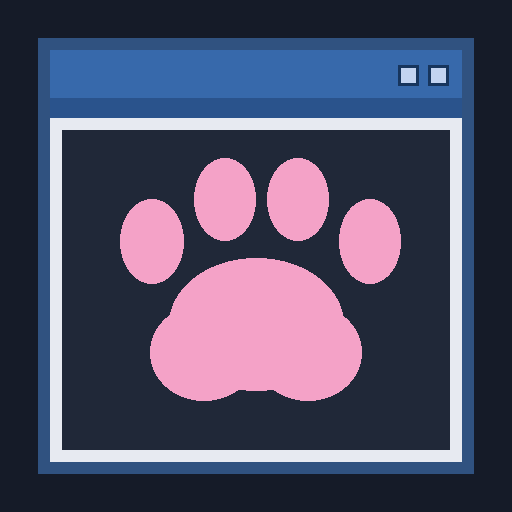

# Discord Rich Presence

Pawtism can display its name, Minecraft version, session timer and current activity in the Discord desktop app. Version **1.4.1** includes an official Pawtism application, so you can enable the feature without creating an application or entering an ID.

## Turn it on

1. Start the Discord desktop app.
2. Press **Right Shift** and choose **UI**.
3. Turn on **Discord Rich Presence**.

Leave **Discord application ID** blank under **UI → Module settings** to use Pawtism's official application. The feature stays off until you enable it. Installing or updating the client does not enable it automatically.

The status line in **UI → Module settings** shows whether Rich Presence is disabled, connecting, waiting for Discord, accepted or rejected.

## Pawtism application

The official application is named **Pawtism Client**. Its public Application ID is **1556850603345576057**.

The window-and-paw icon is original artwork drawn from colored shapes. The application ID is public and does not grant access to an account.

## Activity

- **Main menu** when no world is loaded.
- **Singleplayer** in a local world.
- **Multiplayer** when connected to a server.
- A timer measured from the current Minecraft session's start.

Activity details show **Pawtism Client** and **Minecraft 26.2**. Server addresses, world names, coordinates, player names and chat are excluded.

## Optional custom application

Enter a different public numeric ID in **Discord application ID** to use your own application. Discord uses that application's display name. Clear the field to return to Pawtism's official application.

An application ID is not a password, account token, bot token or client secret. None of those credentials is needed or stored by Pawtism.

To create a custom application, open the [Discord Developer Portal](https://discord.com/developers/applications), give it your preferred name and copy its **Application ID** from General Information. Creating a bot or adding a bot to a server is unnecessary for Rich Presence.

Pawtism saves your override in `config/pawtism/client.json`. Existing custom IDs remain in place when you upgrade. A blank value from an earlier installation uses Pawtism's official application in 1.4.1, while your enabled or disabled preference is preserved.

## Updates and connections

- Presence uses Discord's local IPC connection on a background worker.
- It reconnects when the desktop app becomes available.
- State updates are coalesced and sent at least 15 seconds apart.
- Disabling the module clears the activity and closes the connection.
- Closing Minecraft requests the same cleanup.
- Changing the application ID replaces the connection with one for the selected application.

Minecraft continues running when Discord is closed or unavailable. Windows uses named pipes; macOS and Linux use local sockets. The Discord website and mobile app cannot provide this connection.

## Troubleshooting

- **Waiting for Discord:** open the desktop app and check that it is running under the same user as Minecraft.
- **Invalid application ID:** clear the field to use Pawtism, or check a custom ID for missing digits or extra text.
- **Rejected:** clear a custom override to use Pawtism, or verify your custom application ID. Disable the module while troubleshooting if needed.
- **Accepted but not visible to others:** check Discord's activity sharing preferences and other running activities.

## Validation

Protocol framing, activity content, acknowledgements, reconnection and cleanup have automated tests. A live check on macOS confirmed that Discord Canary accepted Main menu and Singleplayer activities through the client's IPC service; disabling sent a clear command and closed the connection. The Windows transport uses a substitute pipe in tests on macOS; a native Windows run has not been performed. Release verification is recorded separately in `VERIFICATION.txt`.
